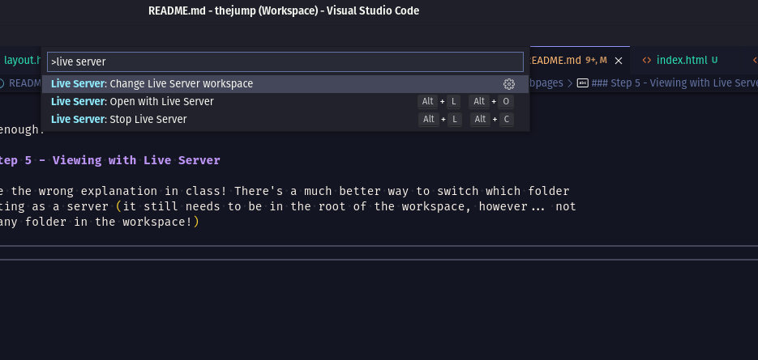

# HTML Builder

## A super simple script (in BASH) for building more modular static webpages

---

#### DISCLAIMER: Not to be used in a production environment. This is for educational purposes only.

---

### Step 1 - Clone this repo into your projects directory as follows:

```bash
$ git clone git@github.com:The-Jump-Digital-School/html-builder.git
```
Remember: The `$` is just for show

### Step 2 - Copy and paste the `build` script into the root directory of the project you're working on - or leave it here and play with the sample website.

```bash
$ cp ./html-builder/build /path/to/project/dir
$ cd /path/to/project/dir
```
OR
```bash
$ cd ./html-builder
```

### Step 3 - Create Layout and Content files

The `build` script looks for __two__ placeholders in your `layout.html` file: `<head-placeholder />` and `<content-placeholder />`, however, they are not _explicitly_ necessary.

Next, it crawls your project directory and looks for `content.html` files and, in the same directory, it looks for a `head.html` file (which is optional) and generates an `index.html` file by inserting the text of the `content.html` and `head.html` files into `<content-placeholder />` and `<head-placeholder />` respectively.

__NOTE__: Any `index.html` file is _overwritten_ with generated content from combining the `layout.html` in the root of the project with any `content.html` and `head.html` files found. If you have any `index.html` files already, be sure to back them up by renaming them.

```bash
$ mv index.html index_old.html # or similar
```

Your __layout__ file contains the `HTML` that is common across all your pages. This will be things like `<html>`, `<head>`, `<body>`, `<nav>`, `<header>`, etc. This project contains a `layout.html` file for reference. This file is to sit at the root of your project directory along with the `build` script.

Your `head.html` and `content.html` files sit wherever you wish to serve a webpage (eg. the root `/` of your website folder, `/contact-us`, `/about-me`, etc). The `head.html` isn't necessary, but it allows us to insert extra __styles__ or __scripts__ into the `<head>` defined in our __layout__ file that are specific to the page we're viewing.

For example, you might have a tree as follows:

- `/` (root of your project directory)
  - `build`
  - `layout.html`
  - `content.html`
  - `style.css`
  - `sub-page/`
    - `head.html`
    - `content.html`
    - `style.css`

Our `/layout.html` file might look something like this:

```html
<!DOCTYPE html>
<html lang="en">
<head>
	<meta charset="UTF-8">
	<title>HTML Builder</title>

	<!-- Please note the forward slash -->
	<link href="/style.css" rel="stylesheet" type="text/css" />

	<!-- insert head.html contents here: -->
	<head-placeholder />
</head>

<body>
	<header>
		<h1>HTML Builder</h1>
		<nav></nav>
	</header>
	<main>
		<!-- insert content.html here: -->
		<content-placeholder />
	</main>
	<footer>
		&copy; 2021 Blah blah blah
	</footer>
</body>
</html>
```
Straight forward enough!

Our `content.html` and `head.html` files are simply snippets of HTML that get inserted into our __layout__ and then an `index.html` file is generated.

Our `/content.html` might look like:

```html
<h1>Hello, World.</h1>
<h2>This is the index page of our website</h2>
```

Our `/sub-page/head.html` might look like:

```html
<!-- Please note the leading './' -->
<link rel="stylesheet" type="text.css" href="./style.css" />

<script type="text/javascript">
	console.log(
		`Open the console to see this message.`
	);
</script>
```

and our `/sub-page/content.html` might look like:

```html
<h1>This is the Sub-Page</h1>
<h2>It's a good one</h2>
```

### Step 4 - Building Your Project

To generate our `index.html` files, we simply navigate to the root of our project's directory and type into the terminal:

```bash
$ ./build
```

This will generate a tree such as the following:

- `/` (root of your project directory)
  - `build`
  - `layout.html`
  - `content.html`
  - `index.html` <-- generated file
  - `style.css`
  - `sub-page/`
    - `head.html`
    - `content.html`
    - `index.html` <-- generated file
    - `style.css`

Our generated `/index.html` file will look like:

```html
<!DOCTYPE html>
<html lang="en">
<head>
	<meta charset="UTF-8">
	<title>HTML Builder</title>

	<!-- Please note the forward slash -->
	<link href="/style.css" rel="stylesheet" type="text/css" />

	<!-- insert head.html contents here: -->
	
</head>

<body>
	<header>
		<h1>HTML Builder</h1>
		<nav></nav>
	</header>
	<main>
		<!-- insert content.html here: -->
		<h1>Hello, World.</h1>
        <h2>This is the index page of our website</h2>
	</main>
	<footer>
		&copy; 2021 Blah blah blah
	</footer>
</body>
</html>
```

and our `/sub-page/index.html` file will look like:

```html
<!DOCTYPE html>
<html lang="en">
<head>
	<meta charset="UTF-8">
	<title>HTML Builder</title>

	<!-- Please note the forward slash -->
	<link href="/style.css" rel="stylesheet" type="text/css" />

	<!-- insert head.html contents here: -->
	<link rel="stylesheet" type="text.css" href="./style.css" />

	<script type="text/javascript">
		console.log(
			`Open the console to see this message.`
		);
	</script>
</head>

<body>
	<header>
		<h1>HTML Builder</h1>
		<nav></nav>
	</header>
	<main>
		<!-- insert content.html here: -->
		<h1>This is the Sub-Page</h1>
        <h2>It's a good one</h2>
	</main>
	<footer>
		&copy; 2021 Blah blah blah
	</footer>
</body>
</html>
```

Easy enough!

### Step 5 - Viewing with Live Server

I gave the wrong explanation in class! There's a much better way to switch which folder
is acting as a server (it still needs to be in the root of the workspace, however... not
just any folder in the workspace!)

Simply press `ctrl + shift + p` in your vs-code editor and type in the words `change live
server` and you will see the following options:



First select the `Stop Live Server` option, then repeat the above step and select the
`Change Live Server workspace` option and choose from one of the folders in the following
menu using your arrow-keys or your mouse.

When wanting to view a project, be sure the folder is added to the workspace and isn't
just a subdirectory of some other folder that was added. Then follow the steps above to
switch your live server to the desired project you wish to view at `localhost:5500`.
